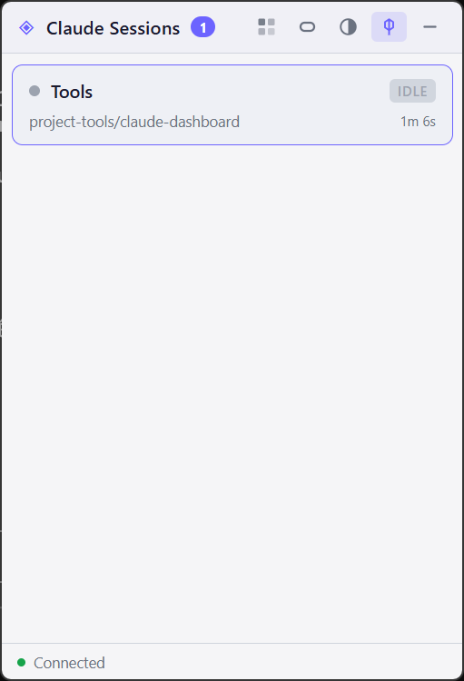
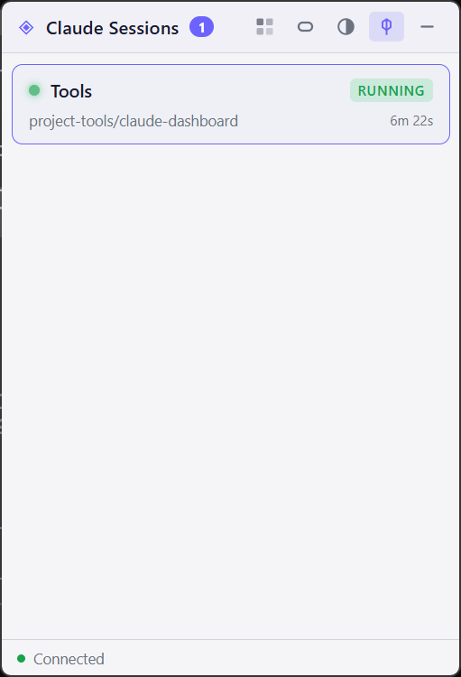
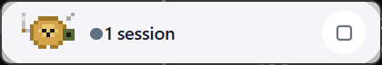
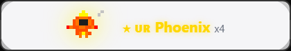
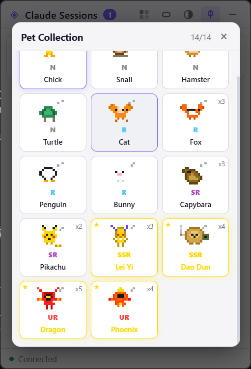

<p align="center">
  
</p>

<h1 align="center">Claude Buddy</h1>

<p align="center">
  <strong>A floating desktop companion for Claude Code power users.</strong><br>
  Real-time session monitoring &bull; Pixel pet gacha &bull; Dynamic Island mode
</p>

<p align="center">
  <a href="https://github.com/handsome-rich/claude-buddy/releases">
    
  </a>
  
  
  <a href="LICENSE">
    
  </a>
</p>

<p align="center">
  <a href="README_CN.md">中文文档</a>
</p>

<p align="center">
  
  &nbsp;&nbsp;
  
</p>

---

## The Problem

Running multiple Claude Code sessions in parallel means constantly switching terminal tabs to check:

- *Is that session waiting for my permission?*
- *Did that long task finish yet?*
- *What is Claude doing right now?*

**Claude Buddy** puts all of this into a single floating widget. One glance, full picture.

---

## Features

### Session Monitor

Real-time tracking via Claude Code [hooks](https://docs.anthropic.com/en/docs/claude-code/hooks). Zero configuration needed.

| Status | Indicator | Meaning |
|--------|-----------|---------|
| Running | :green_circle: Pulsing green | Claude is working |
| Waiting | :yellow_circle: Solid yellow | Needs your permission |
| Idle | :white_circle: Gray | Done or paused |

- **Auto-sort**: waiting sessions float to the top so you never miss them
- **Quick jump**: click a session card to focus its terminal tab
- **Rename**: double-click to give sessions meaningful names (persisted per directory)
- **Context menu**: right-click for Focus / Rename / Remove

### Dynamic Island

<p align="center">
  
</p>

A compact pill-shaped floating bar for minimal screen distraction:

- Color-coded dots per session (yellow = needs attention)
- Pixel pet animates with session state changes
- Draggable, always on top, theme-aware

### Pixel Pet Gacha

<p align="center">
  
</p>

Every time a Claude Code session ends, there's a chance to hatch a pet. The egg-crack animation plays right inside the Dynamic Island.

**14 pets across 5 rarity tiers:**

| Rarity | Pets | Drop Rule |
|--------|------|-----------|
| **N** | Chick, Snail, Hamster, Turtle | One-time (removed from pool once owned) |
| **R** | Cat, Fox, Penguin, Bunny | One-time |
| **SR** | Capybara, Pikachu | One-time |
| **SSR** | Lei Yi, Dao Dun | Repeatable |
| **UR** | Dragon, Phoenix | Repeatable |

- Base drop rate: **15%**, +10% if session > 10 min, +10% if > 30 min
- Collect 3 of the same SSR/UR pet to trigger **Golden Evolution** (special glow effect)

### Pet Collection

<p align="center">
  
</p>

Browse all 14 pets. Click any unlocked pet to set it as your active companion. Golden-evolved pets display a star badge and golden border.

### Themes

4 built-in themes with opacity slider:

| Dark | Light | Glass | Cyberpunk |
|------|-------|-------|-----------|

### Window Behavior

- Always on top (screen-saver level)
- Minimize to system tray
- Frameless & draggable
- Auto-launch when Claude Code starts a session

---

## Quick Start

```bash
git clone https://github.com/handsome-rich/claude-buddy.git
cd claude-buddy
npm install
npm start
```

On first launch, Claude Buddy **automatically configures hooks** in `~/.claude/settings.json`. Your starter pet (Chick) is unlocked immediately.

### Build Portable EXE

```bash
npm run build
# Output: dist/ClaudeDashboard.exe
```

---

## How It Works

```
Claude Code hooks ──curl──▶ Express (127.0.0.1:3120) ──ws──▶ Electron UI
                                    │
                              Gacha roll on Stop
                                    │
                              ~/.claude/dashboard/gacha.json
```

1. Claude Code fires lifecycle hooks (SessionStart / PreToolUse / Stop)
2. Hooks send HTTP POST to the local Express server inside Electron
3. Express broadcasts state changes to the renderer via WebSocket
4. On session stop, a gacha roll is triggered with rarity-weighted RNG

## Project Structure

```
claude-buddy/
├── main.js              # Main process: Express + WebSocket + Gacha engine
├── preload.js           # Electron context bridge
├── focus-tab.ps1        # PowerShell script to focus Windows Terminal tabs
├── package.json
├── icon.ico
├── renderer/
│   ├── index.html       # UI shell
│   ├── style.css        # 4 themes + Dynamic Island + animations
│   ├── app.js           # WebSocket client, rendering, gacha notifications
│   └── pets.js          # 14 pixel pets (compressed pixel art) + unlock system
└── screenshots/
```

## Requirements

- **OS**: Windows 10 / 11 (Windows Terminal recommended)
- **Runtime**: Node.js >= 18
- **CLI**: [Claude Code](https://docs.anthropic.com/en/docs/claude-code) installed

## License

MIT
